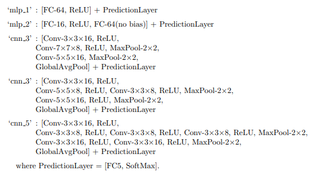

# Description
5 different neural network acrhitecutres are tested on the fashion MNIST dataset. Following 5 models are used:

The code trains on the data at an arbitrary location and saves the following results as a dict file to an arbitrary location:
* ‘name’: name of the architecture
* ‘relu loss curve’: the training loss curve of the ANN with ReLU
* ‘sigmoid loss curve’: the training loss curve of the ANN with logistic sigmoid
* ‘relu grad curve’: the curve of the magnitude of the loss gradient of the ANN with ReLU
* ‘sigmoid grad curve’: the curve of the magnitude of the loss gradient of the ANN with ReLU

To run the code: 

*python train.py dataset_path model_name save_path*

